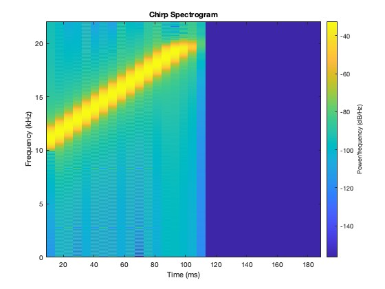
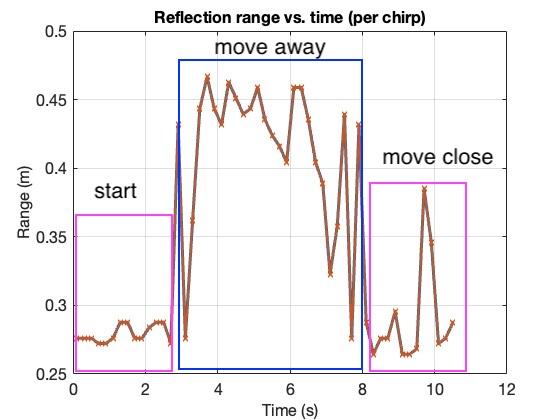

# Practical Acoustic Sensing (CSCI 4900/6900)

This repository contains a simple **end-to-end acoustic ranging demo**.  
It is organized into two main parts:

1. **`iphone/`** – an iOS demo app for **audio recording and broadcasting**.  
2. **`ranging/`** – MATLAB scripts for **chirp generation** and **post-processing** to estimate reflection range.

---

## Workflow

1. **Signal Generation**  
   - `ranging/chirp_signal.m` generates a linear chirp from 10 kHz → 20 kHz over 0.1 s, with an appended 100 ms silence.  
   - The generated WAV file is embedded into the iPhone app for playback.

2. **iPhone App (`iphone/audio-io`)**  
   - A simple iOS app built in Xcode.  
   - Functions:  
     - Play chirp signals through the speaker.  
     - Record microphone input simultaneously.  
   - Output: audio recordings (`recording.wav`) that contain direct and reflected chirp signals.

3. **Post-Processing (`ranging/`)**  
   - `ranging.m` loads the recorded audio and applies **matched filtering** with the reference chirp.  
   - Detects direct arrivals and reflections.  
   - Converts reflection delays into **range estimates**.  
   - Example result (`results.jpg`) shows range variation when a hand moves closer/farther from the phone.

---

## Example Results

**Chirp Spectrogram**  

**Reflection Range Tracking**  

- The plot shows three phases: **start**, **move away**, and **move close**, corresponding to hand movement relative to the iPhone.

---

## How to Use

### Requirements
- macOS with **Xcode** (for the iOS app).  
- **MATLAB** (for signal generation & processing).  

### Steps
1. Run `chirp_signal.m` in MATLAB to generate the chirp WAV.  
2. Load the WAV file into the iPhone app project (`audio-io`) and run on a device.  
3. Record while moving your hand near the iPhone.  
4. Copy the recorded WAV back into `ranging/`.  
5. Run `ranging.m` to produce the range plot.

---

## Notes
- The app and scripts are simplified for **teaching/demo purposes**.  
- The code demonstrates the fundamental pipeline: **signal design → capture → matched filter → ranging**.  
- For more advanced use, you may add noise reduction, multi-peak tracking, or sub-sample delay estimation.

---

## License
MIT License